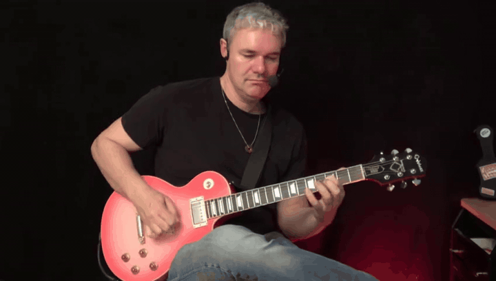
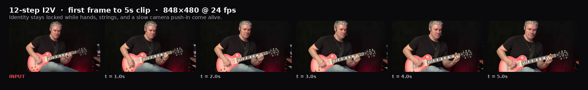
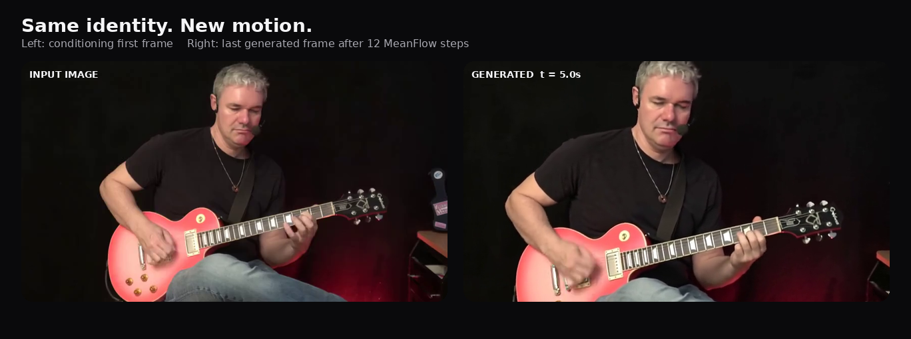
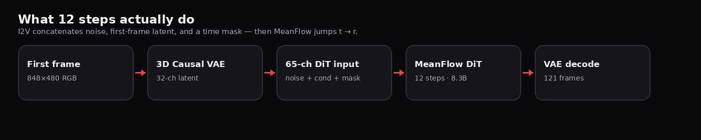

<div align="center">

# HunyuanVideo-1.5

### One still. Five seconds of guitar, hands, and a slow push-in.

**480P Image-to-Video · 12-step MeanFlow Distilled · Diffusers classroom repo**

[](https://arxiv.org/abs/2511.18870)
[](https://huggingface.co/hunyuanvideo-community/HunyuanVideo-1.5-Diffusers-480p_i2v_step_distilled)
[](https://github.com/Tencent-Hunyuan/HunyuanVideo-1.5)
[](https://huggingface.co/docs/diffusers)
[](LICENSE.txt)

[Demo MP4](example/hunyuan15_i2v_step12.mp4) · [Classroom notebook](notebooks/HunyuanVideo1_5_480p_I2V_StepDistilled_课堂讲解.ipynb) · [Run inference](#-inference)



<p>
<b>12 steps</b> &nbsp;·&nbsp; <b>121 frames</b> &nbsp;·&nbsp; <b>848×480 · 24 fps · 5.04s</b><br>
Peak VRAM <b>~20.3 GB</b> on a single RTX 4080 SUPER &nbsp;·&nbsp; ~388s end-to-end
</p>

</div>

This repository follows the layout of [Helios](https://github.com/PKU-YuanGroup/Helios): a root inference entry, `scripts/` for download and launch, `example/` for demo assets, and a notebook for teaching. The model is **HunyuanVideo-1.5** from Tencent. Here we package Diffusers inference and classroom notes around the **480P I2V Step-Distilled** checkpoint.

## 🎬 Watch the demo

The clip below is **not a cherry-picked montage**. It is the official 12-step pipeline on one first frame: identity locked, left hand walking the fretboard, right hand strumming, cloth moving, slow camera push-in.

<div align="center">

</div>

<br>

<div align="center">

</div>

**Prompt**

> A man with short gray hair plays a red electric guitar. His hands move naturally along the strings and fretboard. Subtle body movement, realistic cloth motion, a slow camera push-in, stable identity, continuous shot, cinematic natural lighting.

| Asset | Path |
| --- | --- |
| Looping GIF (README) | [`assets/demo.gif`](assets/demo.gif) |
| Full MP4, 24 fps | [`example/hunyuan15_i2v_step12.mp4`](example/hunyuan15_i2v_step12.mp4) |
| First frame | [`example/guitar-man.png`](example/guitar-man.png) |
| Prompt file | [`example/prompt.txt`](example/prompt.txt) |

## ✨ Highlights

1. **From one photo to a playable shot.** First-frame image + text → 121 frames at 848×480, 24 fps (~5s) via `HunyuanVideo15ImageToVideoPipeline`.
2. **Step-Distilled MeanFlow in 8 or 12 steps** (4 steps is faster, slightly worse). CFG scale is 1.0; flow shift is 7.
3. **You can see the 65-channel trick.** Noise latent (32) + first-frame latent (32) + time mask (1). The mask is `1` only on latent time 0.
4. **Runs on a 32GB consumer GPU.** Validated on RTX 4080 SUPER: CPU offload, VAE tiling/slicing, broadcast attention mask, Flash/Efficient SDPA. Peak allocated memory ~20.3GB.

<div align="center">

</div>

## 📣 Latest News

* `[2026.08.27]` 🎬 Added looping demo GIF, keyframe strip, and input-vs-output card for the README.
* `[2026.08.27]` 🔥 Classroom repo: Diffusers inference, Helios-style scripts, executed notebook on AutoDL (RTX 4080 SUPER 32GB).
* `[2025.12.05]` 🚀 Tencent released the [480P I2V step-distilled](https://huggingface.co/tencent/HunyuanVideo-1.5/tree/main/transformer/480p_i2v_step_distilled) checkpoint (8 or 12 steps recommended).

## 🔥 Friendly Links

* [Tencent-Hunyuan/HunyuanVideo-1.5](https://github.com/Tencent-Hunyuan/HunyuanVideo-1.5): official training/inference code and native `generate.py`.
* [Diffusers HunyuanVideo-1.5 I2V](https://huggingface.co/hunyuanvideo-community/HunyuanVideo-1.5-Diffusers-480p_i2v_step_distilled): community Diffusers conversion used here.
* [Helios](https://github.com/PKU-YuanGroup/Helios): layout and README structure this repository follows.

## ⚙️ Requirements and Installation

### Prepare Environment

```bash
# 0. Clone the repo
git clone git@github.com:jiayuding866-spec/HunyuanVideo.git
cd HunyuanVideo

# 1. Create conda environment
conda create -n hunyuanvideo python=3.12 -y
conda activate hunyuanvideo

# 2. Install PyTorch (adjust for your CUDA version)
# CUDA 12.8
pip install torch torchvision torchaudio --index-url https://download.pytorch.org/whl/cu128

# 3. Install dependencies
bash install.sh
```

Recommended stack (validated):

| Item | Version |
| --- | --- |
| Python | 3.12 |
| PyTorch | 2.8.0+cu128 |
| GPU | NVIDIA GPU with ≥24GB VRAM (32GB comfortable with offload) |
| diffusers | ≥ 0.36.0 (0.40.0 used here) |
| transformers | ≥ 4.57.0 |

> 💡 If `huggingface.co` is unreachable, set `export HF_ENDPOINT=https://hf-mirror.com` before download and inference.

### Model Download

| Model | Download | Supports | Notes |
| --- | --- | --- | --- |
| HunyuanVideo-1.5 480P I2V Step-Distilled (Diffusers) | 🤗 [Hugging Face](https://huggingface.co/hunyuanvideo-community/HunyuanVideo-1.5-Diffusers-480p_i2v_step_distilled) | I2V ✅ | 8.3B DiT, MeanFlow, 8 or 12 steps, CFG=1 |
| Official native weights | 🤗 [tencent/HunyuanVideo-1.5](https://huggingface.co/tencent/HunyuanVideo-1.5) | T2V / I2V / SR | Use official `generate.py --enable_step_distill` |

```bash
bash scripts/download/download_model.sh
```

Weights are large (~34GB). Keep them on a data disk if the system disk is small. This git repo does **not** include checkpoints.

## 🚀 Inference

Reproduce the demo above:

```bash
bash scripts/inference/hunyuan15_i2v_step_distilled.sh
```

Or from the repo root:

```bash
CUDA_VISIBLE_DEVICES=0 python infer_hunyuan.py \
  --model_path "./models/HunyuanVideo-1.5-Diffusers-480p_i2v_step_distilled" \
  --image_path "example/guitar-man.png" \
  --prompt "$(cat example/prompt.txt)" \
  --num_frames 121 \
  --num_inference_steps 12 \
  --fps 24 \
  --seed 42 \
  --output_folder "./output_hunyuan" \
  --enable_cpu_offload \
  --enable_low_vram_attn
```

| Setting | Value |
| --- | --- |
| Resolution | 848×480 |
| Frames / fps | 121 / 24 (~5.04s) |
| Steps | 8 or **12** (4 is a speed ablation) |
| CFG / flow shift | 1.0 / 7 |
| Seed (this demo) | 42 |

`--enable_low_vram_attn` replaces the official `[B,1,S,S]` padding mask with a broadcast `[B,1,1,S]` key-padding mask so 121-frame attention does not allocate an extra ~5GB.

### ✨ Diffusers Pipeline

```python
import torch
from torch.nn.attention import SDPBackend, sdpa_kernel
from diffusers import HunyuanVideo15ImageToVideoPipeline
from diffusers.utils import export_to_video, load_image

pipe = HunyuanVideo15ImageToVideoPipeline.from_pretrained(
    "hunyuanvideo-community/HunyuanVideo-1.5-Diffusers-480p_i2v_step_distilled",
    torch_dtype=torch.bfloat16,
)
pipe.enable_model_cpu_offload()
pipe.vae.enable_tiling()
pipe.vae.enable_slicing()

image = load_image("example/guitar-man.png").convert("RGB")
generator = torch.Generator(device="cuda").manual_seed(42)

with sdpa_kernel([SDPBackend.FLASH_ATTENTION, SDPBackend.EFFICIENT_ATTENTION], set_priority=True):
    video = pipe(
        image=image,
        prompt=open("example/prompt.txt").read().strip(),
        negative_prompt="flicker, jump cut, sudden scene change, duplicated limbs, distorted hands, identity change, static frame, low quality",
        generator=generator,
        num_frames=121,
        num_inference_steps=12,
    ).frames[0]

export_to_video(video, "output.mp4", fps=24)
```

### ✨ Classroom Notebook

The executed walkthrough is [`notebooks/HunyuanVideo1_5_480p_I2V_StepDistilled_课堂讲解.ipynb`](notebooks/HunyuanVideo1_5_480p_I2V_StepDistilled_课堂讲解.ipynb).

It loads the pipeline, shows the demo MP4, then opens every module:

| Module | Size | Shape / note |
| --- | --- | --- |
| Video DiT | 8.331B bf16 | `in_channels=65`, `use_meanflow=True`, 54 layers |
| 3D Causal VAE | 1.261B | spatial ×16, temporal ×4 |
| Qwen2.5-VL | 7.071B | `(1, 1000, 3584)` |
| ByT5 | 0.219B | `(1, 256, 1472)` |
| SigLIP | 0.428B | `(1, 729, 1152)` |

DiT input is `torch.cat([noise_latents, cond_latents, cond_mask], dim=1)` → `(1, 65, 31, 30, 53)`. The condition mask is `1` only on latent time index 0.

`RUN_MANUAL_LOOP` and `RUN_ABLATIONS` stay `False` by default.

## 🗝️ Training

Training lives in the [official HunyuanVideo-1.5 repository](https://github.com/Tencent-Hunyuan/HunyuanVideo-1.5). This classroom repo is inference-only.

## 👍 Acknowledgement

This project would not exist without [HunyuanVideo-1.5](https://github.com/Tencent-Hunyuan/HunyuanVideo-1.5), [Diffusers](https://github.com/huggingface/diffusers), [Transformers](https://github.com/huggingface/transformers), [Qwen-VL](https://github.com/QwenLM/Qwen-VL), and the README/layout of [Helios](https://github.com/PKU-YuanGroup/Helios).

## 🔒 License

Code in this repository is released under the Apache 2.0 license in [`LICENSE.txt`](LICENSE.txt). HunyuanVideo-1.5 **weights** remain under Tencent's model license; download and use them according to the official Hugging Face / GitHub terms.

## ✏️ Citation

If you use HunyuanVideo-1.5, please cite the official report:

```bibtex
@misc{hunyuanvideo2025,
      title={HunyuanVideo 1.5 Technical Report},
      author={Tencent Hunyuan Foundation Model Team},
      year={2025},
      eprint={2511.18870},
      archivePrefix={arXiv},
      primaryClass={cs.CV},
      url={https://arxiv.org/abs/2511.18870},
}
```

## 🤝 Contact

Questions and feedback: open an issue on [jiayuding866-spec/HunyuanVideo](https://github.com/jiayuding866-spec/HunyuanVideo).
