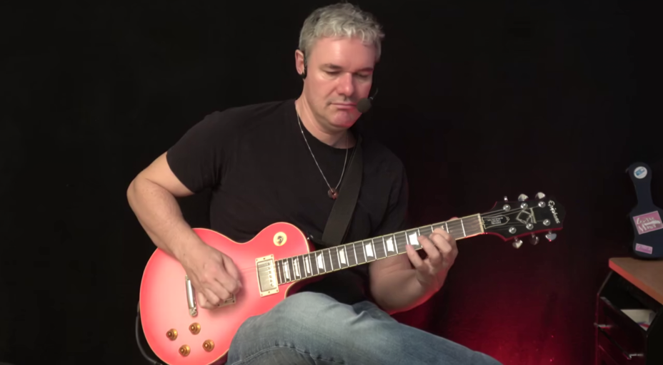

# HunyuanVideo-1.5: 480P I2V Step-Distilled Classroom Repo

##### Classroom Diffusers inference for Tencent HunyuanVideo-1.5 480P image-to-video, with a module-level walkthrough of Qwen2.5-VL, ByT5, SigLIP, 3D Causal VAE, 65-channel DiT input, and MeanFlow distillation.

[](https://arxiv.org/abs/2511.18870)
[](https://huggingface.co/hunyuanvideo-community/HunyuanVideo-1.5-Diffusers-480p_i2v_step_distilled)
[](https://github.com/Tencent-Hunyuan/HunyuanVideo-1.5)
[](https://huggingface.co/docs/diffusers)
[](LICENSE.txt)

This repository follows the layout of [Helios](https://github.com/PKU-YuanGroup/Helios): a root inference entry, `scripts/` for download and launch, `example/` for demo assets, and a notebook for teaching. The model itself is **HunyuanVideo-1.5** from Tencent; this repo packages Diffusers inference and classroom notes around the **480P I2V Step-Distilled** checkpoint.

## ✨ Highlights

1. **Official Diffusers I2V path.** First-frame image + text prompt → 121 frames at 848×480, 24 fps (~5s), using `HunyuanVideo15ImageToVideoPipeline`.
2. **Step-Distilled MeanFlow in 8 or 12 steps** (4 steps is faster, slightly worse). CFG scale is 1.0; flow shift is 7. No extra CFG distillation at inference time.
3. **Module-level classroom notebook.** Walks through Qwen2.5-VL + ByT5 text, SigLIP image tokens, 3D Causal VAE, 65-channel DiT input (`32` noise + `32` first-frame latent + `1` mask), and one DiT / scheduler step.
4. **Consumer-GPU recipe.** Validated on a single **RTX 4080 SUPER 32GB**: CPU offload, VAE tiling/slicing, broadcast attention mask, Flash/Efficient SDPA. Peak allocated memory ~20.3GB for the 12-step official generate.

## 🎬 Video Demos

| First frame | 12-step I2V (~5s, 24 fps) |
| --- | --- |
|  | [example/hunyuan15_i2v_step12.mp4](example/hunyuan15_i2v_step12.mp4) |

Prompt is in [`example/prompt.txt`](example/prompt.txt). On RTX 4080 SUPER 32GB this sample took about **388s** end-to-end.

## 📣 Latest News

* `[2026.08.27]` 🔥 Release this classroom repo: Diffusers inference, Helios-style scripts, and an executed notebook on AutoDL (RTX 4080 SUPER 32GB).
* `[2025.12.05]` 🚀 Tencent released the [480P I2V step-distilled](https://huggingface.co/tencent/HunyuanVideo-1.5/tree/main/transformer/480p_i2v_step_distilled) checkpoint (8 or 12 steps recommended).

## 🔥 Friendly Links

* [Tencent-Hunyuan/HunyuanVideo-1.5](https://github.com/Tencent-Hunyuan/HunyuanVideo-1.5): official training/inference code and native `generate.py`.
* [Diffusers HunyuanVideo-1.5 I2V](https://huggingface.co/hunyuanvideo-community/HunyuanVideo-1.5-Diffusers-480p_i2v_step_distilled): community Diffusers conversion used here.
* [Helios](https://github.com/PKU-YuanGroup/Helios): layout and README structure this repository follows.

## ⚙️ Requirements and Installation

### Prepare Environment

```bash
# 0. Clone the repo
git clone git@github.com:jiayuding866-spec/HunyuanVideo.git
cd HunyuanVideo

# 1. Create conda environment
conda create -n hunyuanvideo python=3.12 -y
conda activate hunyuanvideo

# 2. Install PyTorch (adjust for your CUDA version)
# CUDA 12.8
pip install torch torchvision torchaudio --index-url https://download.pytorch.org/whl/cu128

# 3. Install dependencies
bash install.sh
```

Recommended stack (validated):

| Item | Version |
| --- | --- |
| Python | 3.12 |
| PyTorch | 2.8.0+cu128 |
| GPU | NVIDIA GPU with ≥24GB VRAM (32GB comfortable with offload) |
| diffusers | ≥ 0.36.0 (0.40.0 used here) |
| transformers | ≥ 4.57.0 |

> 💡 If `huggingface.co` is unreachable, set `export HF_ENDPOINT=https://hf-mirror.com` before download and inference.

### Model Download

| Model | Download | Supports | Notes |
| --- | --- | --- | --- |
| HunyuanVideo-1.5 480P I2V Step-Distilled (Diffusers) | 🤗 [Hugging Face](https://huggingface.co/hunyuanvideo-community/HunyuanVideo-1.5-Diffusers-480p_i2v_step_distilled) | I2V ✅ | 8.3B DiT, MeanFlow, 8 or 12 steps, CFG=1 |
| Official native weights | 🤗 [tencent/HunyuanVideo-1.5](https://huggingface.co/tencent/HunyuanVideo-1.5) | T2V / I2V / SR | Use official `generate.py --enable_step_distill` |

```bash
bash scripts/download/download_model.sh
```

Weights are large (~34GB). Keep them on a data disk if the system disk is small. This git repo does **not** include checkpoints.

## 🚀 Inference

HunyuanVideo-1.5 I2V here generates **121 frames** by default. At 24 fps that is about **5 seconds**. Official step-distilled guidance:

| Model | CFG Scale | Flow Shift | Inference Steps |
| --- | --- | --- | --- |
| 480P I2V Step Distilled | 1 | 7 | 8 or 12 (recommended; 4 is faster) |

### Run the model

```bash
cd scripts/inference
bash hunyuan15_i2v_step_distilled.sh
```

Or from the repo root:

```bash
CUDA_VISIBLE_DEVICES=0 python infer_hunyuan.py \
  --model_path "./models/HunyuanVideo-1.5-Diffusers-480p_i2v_step_distilled" \
  --image_path "example/guitar-man.png" \
  --prompt "$(cat example/prompt.txt)" \
  --num_frames 121 \
  --num_inference_steps 12 \
  --fps 24 \
  --seed 42 \
  --output_folder "./output_hunyuan" \
  --enable_cpu_offload \
  --enable_low_vram_attn
```

`--enable_low_vram_attn` replaces the official `[B,1,S,S]` padding mask with a broadcast `[B,1,1,S]` key-padding mask so 121-frame attention does not allocate an extra ~5GB.

### ✨ Diffusers Pipeline

```python
import torch
from torch.nn.attention import SDPBackend, sdpa_kernel
from diffusers import HunyuanVideo15ImageToVideoPipeline
from diffusers.utils import export_to_video, load_image

pipe = HunyuanVideo15ImageToVideoPipeline.from_pretrained(
    "hunyuanvideo-community/HunyuanVideo-1.5-Diffusers-480p_i2v_step_distilled",
    torch_dtype=torch.bfloat16,
)
pipe.enable_model_cpu_offload()
pipe.vae.enable_tiling()
pipe.vae.enable_slicing()

image = load_image("example/guitar-man.png").convert("RGB")
generator = torch.Generator(device="cuda").manual_seed(42)

with sdpa_kernel([SDPBackend.FLASH_ATTENTION, SDPBackend.EFFICIENT_ATTENTION], set_priority=True):
    video = pipe(
        image=image,
        prompt=open("example/prompt.txt").read().strip(),
        negative_prompt="flicker, jump cut, sudden scene change, duplicated limbs, distorted hands, identity change, static frame, low quality",
        generator=generator,
        num_frames=121,
        num_inference_steps=12,
    ).frames[0]

export_to_video(video, "output.mp4", fps=24)
```

### ✨ Classroom Notebook

The executed walkthrough is:

[`notebooks/HunyuanVideo1_5_480p_I2V_StepDistilled_课堂讲解.ipynb`](notebooks/HunyuanVideo1_5_480p_I2V_StepDistilled_课堂讲解.ipynb)

It loads the pipeline, generates (or reuses) the demo MP4, then inspects:

| Module | Size | Shape / note |
| --- | --- | --- |
| Video DiT | 8.331B bf16 | `in_channels=65`, `use_meanflow=True`, 54 layers |
| 3D Causal VAE | 1.261B | spatial ×16, temporal ×4 |
| Qwen2.5-VL | 7.071B | `(1, 1000, 3584)` |
| ByT5 | 0.219B | `(1, 256, 1472)` |
| SigLIP | 0.428B | `(1, 729, 1152)` |

DiT input is `torch.cat([noise_latents, cond_latents, cond_mask], dim=1)` → `(1, 65, 31, 30, 53)`. The condition mask is `1` only on latent time index 0.

`RUN_MANUAL_LOOP` and `RUN_ABLATIONS` stay `False` by default.

## 🗝️ Training

Training lives in the [official HunyuanVideo-1.5 repository](https://github.com/Tencent-Hunyuan/HunyuanVideo-1.5). This classroom repo is inference-only.

## 👍 Acknowledgement

This project would not exist without [HunyuanVideo-1.5](https://github.com/Tencent-Hunyuan/HunyuanVideo-1.5), [Diffusers](https://github.com/huggingface/diffusers), [Transformers](https://github.com/huggingface/transformers), [Qwen-VL](https://github.com/QwenLM/Qwen-VL), and the README/layout of [Helios](https://github.com/PKU-YuanGroup/Helios).

## 🔒 License

Code in this repository is released under the Apache 2.0 license in [`LICENSE.txt`](LICENSE.txt). HunyuanVideo-1.5 **weights** remain under Tencent's model license; download and use them according to the official Hugging Face / GitHub terms.

## ✏️ Citation

If you use HunyuanVideo-1.5, please cite the official report:

```bibtex
@misc{hunyuanvideo2025,
      title={HunyuanVideo 1.5 Technical Report},
      author={Tencent Hunyuan Foundation Model Team},
      year={2025},
      eprint={2511.18870},
      archivePrefix={arXiv},
      primaryClass={cs.CV},
      url={https://arxiv.org/abs/2511.18870},
}
```

## 🤝 Contact

Questions and feedback: open an issue on [jiayuding866-spec/HunyuanVideo](https://github.com/jiayuding866-spec/HunyuanVideo).
